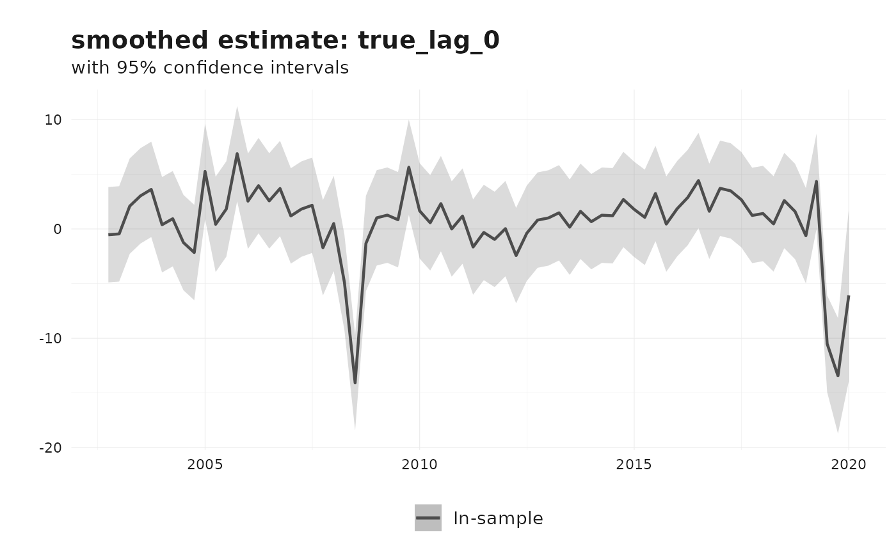
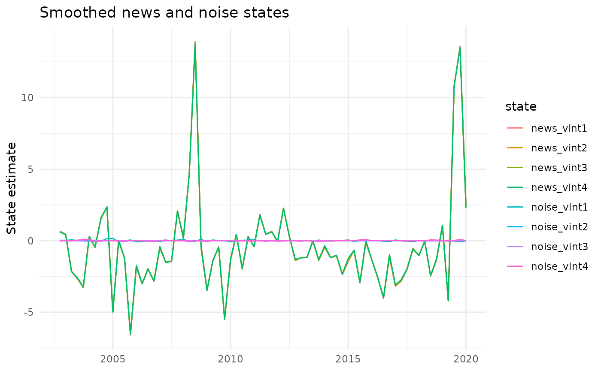

# Nowcasting revisions using the Jacobs-Van Norden model

This vignette illustrates how to estimate a Jacobs-Van Norden (JVN)
model for data revisions using `reviser`. The framework follows the
notation of Jacobs and Van Norden
([2011](#ref-jacobsModelingDataRevisions2011)) as closely as possible,
while documenting the specific restricted AR-based implementation
currently provided by
[`jvn_nowcast()`](https://p-wegmueller.github.io/reviser/reference/jvn_nowcast.md).

The JVN model is useful when several vintages of the same macroeconomic
series are available and revisions are systematic rather than purely
random. It provides a state-space representation that decomposes
revision errors into economically meaningful components and yields
filtered and smoothed estimates of the latent “true” value.

## Notation and setup

Following Jacobs and Van Norden
([2011](#ref-jacobsModelingDataRevisions2011)), superscripts refer to
**vintages** and subscripts to **time periods**. Thus, (y_t^{t+i})
denotes the estimate for period (t) that is available in vintage (t+i).

For a fixed reference period (t), collect the first (l) estimates into
the (l ) vector

\[ y_t = \]

Let (y_t) denote the unobserved “true” value. The JVN framework writes
the measurement error as the difference between the vintage vector and
the true value replicated across vintages:

\[ u_t = y_t - \_l y_t,\]

where (\_l) is an (l ) vector of ones.

A key feature of the JVN framework is that the measurement error is
decomposed into a **news** component and a **noise** component:

\[ y_t = \_l y_t + \_t + \_t.\]

Here:

- (\_t) captures **news**, i.e. information that was not available at
  the time of earlier releases and is incorporated rationally in later
  vintages;
- (\_t) captures **noise**, i.e. transitory measurement error that is
  later removed.

As in the paper, the measurement equation is written with (H = 0), so
all uncertainty enters through the state transition equation rather than
through an additional observation disturbance.

## State-space representation

The generic time-invariant state-space form is

\[ y_t = Z \_t,\]

\[ \_{t+1} = T \_t + R \_t, \_t N(0, I).\]

In the general JVN framework, the state vector is partitioned as

\[ \_t = \]

where (\_t) governs the dynamics of the true value, (\_t) is the vector
of news states, and (\_t) is the vector of noise states.

The measurement matrix is

\[ Z = \[Z_1, Z_2, Z_3, Z_4\]\]

with (Z_1 = \_l), (Z_2 = 0), (Z_3 = I_l), and (Z_4 = I_l), so that

\[ y_t = y_t + \_t + \_t.\]

This is the central decomposition in Jacobs and Van Norden
([2011](#ref-jacobsModelingDataRevisions2011)).

## The implementation in `reviser`

The current
[`reviser::jvn_nowcast()`](https://p-wegmueller.github.io/reviser/reference/jvn_nowcast.md)
function implements a restricted but practically useful version of the
JVN model:

1.  The latent true value (y_t) follows an **AR(p)** process.
2.  The user may include a **news** component, a **noise** component, or
    both.
3.  Optional spillovers are implemented as **diagonal first-order
    persistence** in the news and/or noise state blocks.
4.  Estimation is by **maximum likelihood**.

This corresponds to the restricted AR-based specifications used in the
empirical illustration of Jacobs and Van Norden
([2011](#ref-jacobsModelingDataRevisions2011)). In particular, when
spillovers are included, the current implementation uses diagonal (T_3)
and/or (T_4) blocks rather than unrestricted cross-vintage spillover
matrices.

## AR(p) specification

Suppose the true value follows an AR(p) process. Then the state vector
used by
[`jvn_nowcast()`](https://p-wegmueller.github.io/reviser/reference/jvn_nowcast.md)
is

\[ \_t = \]

where the news and noise blocks are included only if requested.

### Observation equation

If both news and noise are included and (l) vintages are used, the
observation equation is

\[ $$\begin{bmatrix}
{y_{t}^{t + 1}\ y_{t}^{t + 2}\ \vdots\ y_{t}^{t + l}}
\end{bmatrix}$$

  
y_t^{t+l} \end{bmatrix} =============

$$\begin{bmatrix}
1 & 0 & \cdots & 0 & 1 & 0 & \cdots & 0 & 1 & 0 & \cdots & {0\ 1} & 0 & \cdots & 0 & 0 & 1 & \cdots & 0 & 0 & 1 & \cdots & {0\ \vdots} & \vdots & & \vdots & \vdots & \vdots & & \vdots & \vdots & \vdots & & {\vdots\ 1} & 0 & \cdots & 0 & 0 & 0 & \cdots & 1 & 0 & 0 & \cdots & 1
\end{bmatrix}$$

s & 0 & 0 & 1 & & 0 & 0 & 1 & & 0  
& & & & & & & & & & &  
1 & 0 & & 0 & 0 & 0 & & 1 & 0 & 0 & & 1 \end{bmatrix} \_t. \]

Thus each observed vintage loads on the current true value and, if
included, on its corresponding news and noise state.

### Transition equation

For the AR(p) block,
[`jvn_nowcast()`](https://p-wegmueller.github.io/reviser/reference/jvn_nowcast.md)
uses a companion form:

\[ y\_{t+1} ==============

\_1 y_t + *2 y*{t-1} + + *p y*{t-p+1}

- . \]

If news is included, the innovation to the true value also loads on the
news shocks, as in the JVN framework. If noise is included, each noise
state receives its own shock.

If spillovers are included, the implementation adds diagonal persistence
parameters to the corresponding state block:

\[ *{j,t+1} = T*{,j} \_{j,t} + ,\]

\[ *{j,t+1} = T*{,j} \_{j,t} + .\]

These are **restricted diagonal spillover effects**. They should not be
interpreted as the most general spillover dynamics discussed in the
paper.

## Example: AR(2) with four vintages

The paper’s empirical illustration considers an AR(2) specification with
four vintages. In that case, the pure news model can be written as

\[ $$\begin{bmatrix}
{y_{t}^{t + 1}\ y_{t}^{t + 2}\ y_{t}^{t + 3}\ y_{t}^{t + 4}}
\end{bmatrix}$$

y_t^{t+3}  
y_t^{t+4} \end{bmatrix} =============

$$\begin{bmatrix}
\iota_{4} & 0_{4 \times 1} & I_{4}
\end{bmatrix}\begin{bmatrix}
{{\widetilde{y}}_{t}\ {\widetilde{y}}_{t - 1}\ \nu_{t}}
\end{bmatrix}$$

}  
\_t \end{bmatrix}, \]

with transition equation

\[ $$\begin{bmatrix}
{{\widetilde{y}}_{t}\ {\widetilde{y}}_{t - 1}\ \nu_{t}}
\end{bmatrix}$$

}  
\_t \end{bmatrix} =============

$$\begin{bmatrix}
\rho_{1} & \rho_{2} & {0_{1 \times 4}\ 1} & 0 & {0_{1 \times 4}\ 0_{4 \times 1}} & 0_{4 \times 1} & T_{3}
\end{bmatrix}$$ }  
0\_{4 } & 0\_{4 } & T_3 \end{bmatrix} $$\begin{bmatrix}
{{\widetilde{y}}_{t - 1}\ {\widetilde{y}}_{t - 2}\ \nu_{t - 1}}
\end{bmatrix}$$

}  
\_{t-1} \end{bmatrix} + R \_t. \]

Likewise, the pure noise model replaces (\_t) by (\_t) and (T_3) by
(T_4). The most general model used in the paper’s Table 1 includes both
(\_t) and (\_t), with diagonal (T_3) and (T_4) blocks.

In `reviser`, the same broad structure is available through
[`jvn_nowcast()`](https://p-wegmueller.github.io/reviser/reference/jvn_nowcast.md),
with the restriction that the true-value dynamics are AR(p) and
spillovers, if included, are diagonal.

## Preparing the data

We illustrate the use of
[`jvn_nowcast()`](https://p-wegmueller.github.io/reviser/reference/jvn_nowcast.md)
with Euro Area GDP growth data from
[`reviser::gdp`](https://p-wegmueller.github.io/reviser/reference/gdp.md).
We first compute quarter-on-quarter growth rates, then construct a wide
vintage matrix.

``` r
library(reviser)
library(dplyr)
library(tidyr)
library(tsbox)
library(ggplot2)

gdp_growth <- reviser::gdp %>%
  tsbox::ts_pc() %>%
  dplyr::filter(
    id == "EA",
    time >= min(pub_date),
    time <= as.Date("2020-01-01")
  ) %>%
  tidyr::drop_na()

df <- get_nth_release(gdp_growth, n = 0:3)
df
#> # Vintages data (release format):
#> # Format:                         long
#> # Time periods:                   70
#> # Releases:                       4
#> # IDs:                            1
#>    time       pub_date      value id    release  
#>    <date>     <date>        <dbl> <chr> <chr>    
#>  1 2002-10-01 2003-01-01  0.169   EA    release_0
#>  2 2002-10-01 2003-04-01  0.124   EA    release_1
#>  3 2002-10-01 2003-07-01  0.105   EA    release_2
#>  4 2002-10-01 2003-10-01  0.0577  EA    release_3
#>  5 2003-01-01 2003-04-01  0.0149  EA    release_0
#>  6 2003-01-01 2003-07-01 -0.0133  EA    release_1
#>  7 2003-01-01 2003-10-01 -0.0558  EA    release_2
#>  8 2003-01-01 2004-01-01 -0.00601 EA    release_3
#>  9 2003-04-01 2003-07-01  0.00503 EA    release_0
#> 10 2003-04-01 2003-10-01 -0.0616  EA    release_1
#> # ℹ 270 more rows
```

The resulting object contains one row per reference period and one
column per vintage, in the format expected by
[`jvn_nowcast()`](https://p-wegmueller.github.io/reviser/reference/jvn_nowcast.md).

## Estimation

The main arguments of
[`jvn_nowcast()`](https://p-wegmueller.github.io/reviser/reference/jvn_nowcast.md)
are:

- `df`: a vintage matrix or data frame;
- `e`: the number of vintage columns used in estimation;
- `ar_order`: the autoregressive order (p) of the latent true-value
  process;
- `h`: optional forecast horizon;
- `include_news`: whether to include a news component;
- `include_noise`: whether to include a noise component;
- `include_spillovers`: whether to include diagonal spillover
  persistence;
- `spillover_news`, `spillover_noise`: which block(s) receive spillover
  persistence;
- `standardize`: whether to standardize the vintage matrix before
  estimation.

The argument `method` currently only accepts `"MLE"`. Numerical
optimization is controlled through `solver_options`, where the user may
choose among optimizers such as `"L-BFGS-B"`, `"BFGS"`, `"Nelder-Mead"`,
`"nlminb"`, or `"two-step"`.

### News and noise model without spillovers

``` r
fit_nn <- jvn_nowcast(
  df = df,
  e = 4,
  ar_order = 2,
  h = 0,
  include_news = TRUE,
  include_noise = TRUE,
  include_spillovers = FALSE,
  method = "MLE",
  standardize = FALSE,
  solver_options = list(
    method = "L-BFGS-B",
    se_method = "hessian"
  )
)

summary(fit_nn)
#> 
#> === Jacobs-Van Norden Model ===
#> 
#> Convergence: Success 
#> Log-likelihood: 256.22 
#> AIC: -490.44 
#> BIC: -465.7 
#> 
#> Parameter Estimates:
#>     Parameter Estimate Std.Error
#>         rho_1    0.900     0.278
#>         rho_2   -0.236     0.234
#>       sigma_e    0.001     0.540
#>    sigma_nu_1    0.070     0.006
#>    sigma_nu_2    0.052     0.004
#>    sigma_nu_3    0.001     0.036
#>    sigma_nu_4    0.633     0.210
#>  sigma_zeta_1    0.001     0.021
#>  sigma_zeta_2    0.001     0.009
#>  sigma_zeta_3    0.001     0.017
#>  sigma_zeta_4    0.042     0.004
```

This specification estimates a model with both news and noise
components, but no persistence in the measurement-error states.

### Adding spillovers

``` r
fit_full <- jvn_nowcast(
  df = df,
  e = 4,
  ar_order = 2,
  h = 0,
  include_news = TRUE,
  include_noise = TRUE,
  include_spillovers = TRUE,
  spillover_news = TRUE,
  spillover_noise = TRUE,
  method = "MLE",
  standardize = FALSE,
  solver_options = list(
    method = "L-BFGS-B",
    se_method = "hessian"
  )
)

summary(fit_full)
#> 
#> === Jacobs-Van Norden Model ===
#> 
#> Convergence: Success 
#> Log-likelihood: 267.95 
#> AIC: -497.91 
#> BIC: -455.18 
#> 
#> Parameter Estimates:
#>     Parameter Estimate Std.Error
#>         rho_1    0.252     0.103
#>         rho_2    0.101     0.096
#>       sigma_e    0.376     0.126
#>    sigma_nu_1    0.001     0.022
#>    sigma_nu_2    0.043     0.005
#>    sigma_nu_3    0.006     0.000
#>    sigma_nu_4    3.978     4.439
#>  sigma_zeta_1    0.053     0.007
#>  sigma_zeta_2    0.004     0.000
#>  sigma_zeta_3    0.016     0.006
#>  sigma_zeta_4    0.037     0.002
#>        T_nu_1    0.188     0.092
#>        T_nu_2    0.177     0.095
#>        T_nu_3    0.173     0.096
#>        T_nu_4    0.172     0.096
#>      T_zeta_1   -0.020     0.171
#>      T_zeta_2   -0.900     0.000
#>      T_zeta_3   -0.386     0.294
#>      T_zeta_4    0.147     0.143
```

When `include_spillovers = TRUE`, the model adds diagonal persistence
parameters for the selected measurement-error blocks. These correspond
to restricted spillover effects.

## Standardization

In the paper’s empirical illustration, vintages are approximately
standardized using the mean and standard deviation of the final vintage
before estimation. The package provides an optional argument for this
purpose:

``` r
fit_std <- jvn_nowcast(
  df = df,
  e = 4,
  ar_order = 2,
  include_news = TRUE,
  include_noise = TRUE,
  include_spillovers = TRUE,
  standardize = TRUE
)
```

If `standardize = TRUE`, scaling metadata are returned in the `scale`
element of the fitted object.

## Model output

A fitted `jvn_model` object contains:

- `states`: filtered and smoothed state estimates;
- `jvn_model_mat`: estimated state-space matrices;
- `params`: parameter estimates and standard errors;
- `fit`: raw optimizer output;
- `loglik`, `aic`, `bic`: fit statistics;
- `data`: the preprocessed input data;
- `scale`: scaling metadata, if standardization was used;
- `cov`: estimated covariance matrix of the parameters, if available.

The parameter table includes:

- `rho_1, ..., rho_p` for the AR coefficients;
- `sigma_e` for the innovation standard deviation of the true-value
  process;
- `sigma_nu_j` for news shocks;
- `sigma_zeta_j` for noise shocks;
- `T_nu_j` and/or `T_zeta_j` for diagonal spillover persistence
  parameters.

## Filtered and smoothed estimates

The `states` element is returned as a tidy tibble. The state named
`true_lag_0` corresponds to the current latent true value (y_t).

``` r
fit_full$states %>%
  dplyr::filter(state == "true_lag_0") %>%
  dplyr::slice_tail(n = 8)
#> # A tibble: 8 × 7
#>   time       state      estimate    lower upper filter   sample   
#>   <date>     <chr>         <dbl>    <dbl> <dbl> <chr>    <chr>    
#> 1 2018-04-01 true_lag_0    0.460  -3.90    4.82 smoothed in_sample
#> 2 2018-07-01 true_lag_0    2.60   -1.76    6.96 smoothed in_sample
#> 3 2018-10-01 true_lag_0    1.59   -2.77    5.95 smoothed in_sample
#> 4 2019-01-01 true_lag_0   -0.625  -4.99    3.74 smoothed in_sample
#> 5 2019-04-01 true_lag_0    4.34   -0.0206  8.71 smoothed in_sample
#> 6 2019-07-01 true_lag_0  -10.5   -14.9    -6.08 smoothed in_sample
#> 7 2019-10-01 true_lag_0  -13.4   -18.7    -8.15 smoothed in_sample
#> 8 2020-01-01 true_lag_0   -6.08  -13.9     1.77 smoothed in_sample
```

Filtered estimates use only information available up to time (t), while
smoothed estimates use the full sample and are therefore more
appropriate for ex post historical analysis.

## Plotting

The default plot method displays one selected state. By default, it
plots the filtered estimate of `true_lag_0`.

``` r
plot(fit_full)
```


To inspect the smoothed estimate of the latent true value:

``` r
plot(fit_full, state = "true_lag_0", type = "smoothed")
```



We can also visualize the news and noise states directly.

``` r
fit_full$states %>%
  dplyr::filter(
    filter == "smoothed",
    grepl("news|noise", state)
  ) %>%
  ggplot(aes(x = time, y = estimate, color = state)) +
  geom_line() +
  labs(
    title = "Smoothed news and noise states",
    x = NULL,
    y = "State estimate"
  ) +
  theme_minimal()
```



## Comparing nested specifications

The JVN framework nests several empirically relevant cases.

### Pure noise

``` r
fit_noise <- jvn_nowcast(
  df = df,
  e = 4,
  ar_order = 2,
  include_news = FALSE,
  include_noise = TRUE,
  include_spillovers = FALSE,
  solver_options = list(method = "L-BFGS-B")
)
```

### Pure news

``` r
fit_news <- jvn_nowcast(
  df = df,
  e = 4,
  ar_order = 2,
  include_news = TRUE,
  include_noise = FALSE,
  include_spillovers = FALSE,
  solver_options = list(method = "L-BFGS-B")
)
```

### News with spillovers

``` r
fit_news_spill <- jvn_nowcast(
  df = df,
  e = 4,
  ar_order = 2,
  include_news = TRUE,
  include_noise = FALSE,
  include_spillovers = TRUE,
  spillover_news = TRUE,
  spillover_noise = FALSE,
  solver_options = list(method = "L-BFGS-B")
)
```

### Noise with spillovers

``` r
fit_noise_spill <- jvn_nowcast(
  df = df,
  e = 4,
  ar_order = 2,
  include_news = FALSE,
  include_noise = TRUE,
  include_spillovers = TRUE,
  spillover_news = FALSE,
  spillover_noise = TRUE,
  solver_options = list(method = "L-BFGS-B")
)
```

### Information criteria

``` r
dplyr::bind_rows(
  data.frame(
    model = "Pure noise",
    loglik = fit_noise$loglik,
    aic = fit_noise$aic,
    bic = fit_noise$bic
  ),
  data.frame(
    model = "Pure news",
    loglik = fit_news$loglik,
    aic = fit_news$aic,
    bic = fit_news$bic
  ),
  data.frame(
    model = "Noise + spillovers",
    loglik = fit_noise_spill$loglik,
    aic = fit_noise_spill$aic,
    bic = fit_noise_spill$bic
  ),
  data.frame(
    model = "News + spillovers",
    loglik = fit_news_spill$loglik,
    aic = fit_news_spill$aic,
    bic = fit_news_spill$bic
  ),
  data.frame(
    model = "News + noise + spillovers",
    loglik = fit_full$loglik,
    aic = fit_full$aic,
    bic = fit_full$bic
  )
)
#>                       model   loglik       aic       bic
#> 1                Pure noise 232.0056 -450.0113 -434.2718
#> 2                 Pure news 255.0923 -496.1846 -480.4451
#> 3        Noise + spillovers 236.9075 -451.8151 -427.0816
#> 4         News + spillovers 265.2135 -508.4270 -483.6935
#> 5 News + noise + spillovers 267.9527 -497.9055 -455.1841
```

These comparisons are often useful in practice, but they should be
interpreted with care when parameters are on the boundary of the
parameter space, for example when some standard deviations are estimated
close to zero.

## Forecasting and extension of the state estimates

The argument `h` extends the state estimates out of sample by appending
(h) periods with missing observations and running the Kalman filter and
smoother on the augmented system.

``` r
fit_fc <- jvn_nowcast(
  df = df,
  e = 4,
  ar_order = 2,
  h = 4,
  include_news = TRUE,
  include_noise = TRUE,
  include_spillovers = FALSE,
  solver_options = list(method = "L-BFGS-B")
)

fit_fc$states %>%
  dplyr::filter(state == "true_lag_0", filter == "filtered") %>%
  dplyr::slice_tail(n = 8)
#> # A tibble: 8 × 7
#>   time       state      estimate  lower  upper filter   sample       
#>   <date>     <chr>         <dbl>  <dbl>  <dbl> <chr>    <chr>        
#> 1 2019-04-01 true_lag_0   0.147  -1.09   1.39  filtered in_sample    
#> 2 2019-07-01 true_lag_0   0.299  -0.941  1.54  filtered in_sample    
#> 3 2019-10-01 true_lag_0   0.0530 -1.19   1.29  filtered in_sample    
#> 4 2020-01-01 true_lag_0  -3.73   -4.97  -2.49  filtered in_sample    
#> 5 2020-04-01 true_lag_0  -2.43   -4.11  -0.752 filtered out_of_sample
#> 6 2020-07-01 true_lag_0  -1.31   -3.14   0.521 filtered out_of_sample
#> 7 2020-10-01 true_lag_0  -0.604  -2.47   1.27  filtered out_of_sample
#> 8 2021-01-01 true_lag_0  -0.236  -2.11   1.64  filtered out_of_sample
```

The `sample` column distinguishes between in-sample and out-of-sample
periods.

## Numerical options

The function exposes several useful numerical controls through
`solver_options`.

### Optimizer choice

``` r
fit_alt <- jvn_nowcast(
  df = df,
  e = 4,
  ar_order = 2,
  include_news = TRUE,
  include_noise = TRUE,
  solver_options = list(
    method = "nlminb",
    maxiter = 2000
  )
)
```

### Multi-start optimization

For more difficult specifications, multi-start optimization may help
avoid poor local optima.

``` r
fit_ms <- jvn_nowcast(
  df = df,
  e = 4,
  ar_order = 2,
  include_news = TRUE,
  include_noise = TRUE,
  include_spillovers = TRUE,
  solver_options = list(
    method = "L-BFGS-B",
    n_starts = 5,
    seed = 123,
    maxiter = 2000
  )
)
```

### Standard-error estimation

The package currently supports:

- Hessian-based standard errors;
- QML sandwich covariance estimates;
- no standard-error calculation.

``` r
fit_qml <- jvn_nowcast(
  df = df,
  e = 4,
  ar_order = 2,
  include_news = TRUE,
  include_noise = TRUE,
  solver_options = list(
    method = "L-BFGS-B",
    se_method = "qml",
    qml_score_method = "central"
  )
)
```

## Interpretation

The JVN model helps distinguish different sources of revisions.

### News

Large estimated values of (\_{j}) indicate that early releases omit
information that is incorporated in subsequent vintages. In that case,
revisions are informative updates rather than corrections of transitory
noise.

### Noise

Large estimated values of (\_{j}) indicate that early releases are
contaminated by measurement error that is later removed. In that case,
revisions are partly predictable.

### Spillovers

Nonzero (T\_{,j}) or (T\_{,j}) indicate persistence in the corresponding
news or noise states. In the current implementation these are
**restricted own-state persistence parameters**, not unrestricted
cross-vintage spillover coefficients.

### True-value dynamics

The AR coefficients (\_1, , \_p) capture the persistence of the latent
true series.

## Remarks on scope

The original paper presents a broad state-space framework that can
accommodate richer dynamics for the true value and measurement errors.
The current `reviser` implementation is intentionally narrower:

- the true value follows an AR((p)) process;
- the observation equation uses the JVN decomposition into truth, news,
  and noise;
- spillovers are implemented through diagonal persistence in the news
  and/or noise blocks.

This restricted specification is still rich enough to replicate the main
empirical model class used in the paper’s illustration and to support
practical revision modeling, filtering, smoothing, and forecasting.

## References

Jacobs, Jan P. A. M., and Simon Van Norden. 2011. “Modeling Data
Revisions: Measurement Error and Dynamics of ‘True’ Values.” *Journal of
Econometrics* 161 (2): 101–9.
<https://doi.org/10.1016/j.jeconom.2010.04.010>.
