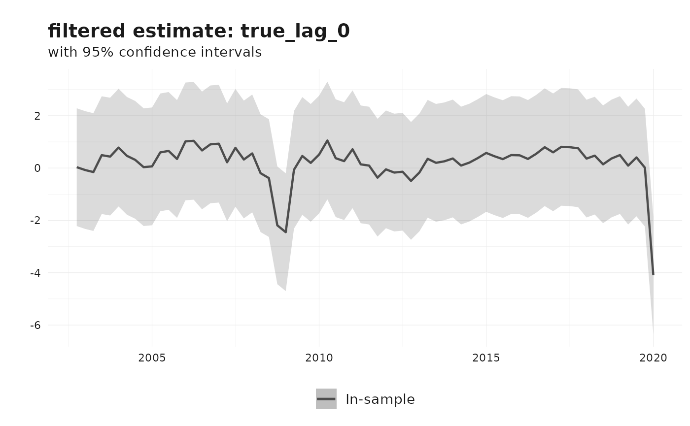
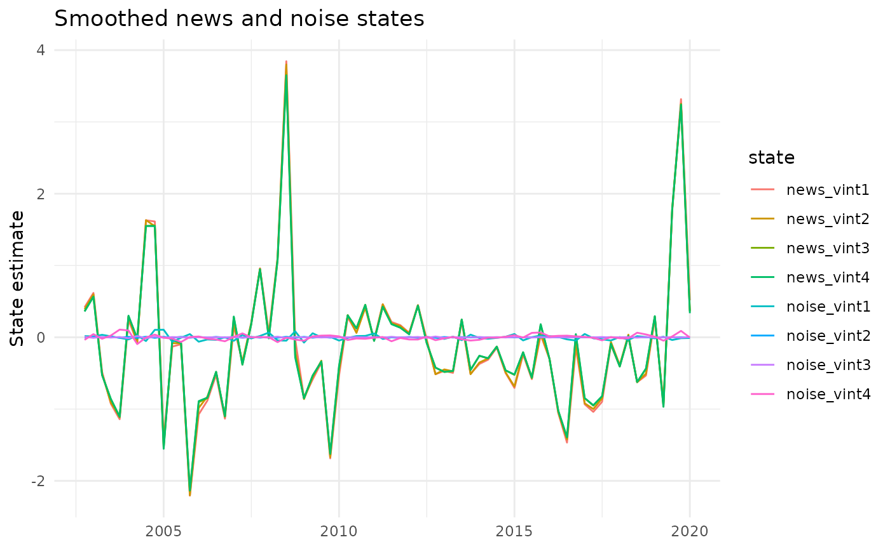

# Nowcasting revisions using the Jacobs-Van Norden model

This vignette describes the Jacobs-Van Norden (JVN) revision model as
implemented in
[`reviser::jvn_nowcast()`](https://p-wegmueller.github.io/reviser/reference/jvn_nowcast.md).
The presentation follows the same Durbin-Koopman state-space notation
used in the KK vignette: observations are linked to latent states
through $Z$, state dynamics through $T$, and innovations through $R$,
$H$, and $Q$([Durbin and Koopman
2012](#ref-durbinTimeSeriesAnalysis2012)).

The key idea of the JVN framework is that revision errors are not
treated as a single residual. Instead, they are decomposed into **news**
and **noise**. News corresponds to genuinely new information
incorporated by later releases, whereas noise corresponds to transitory
measurement error that is corrected in subsequent vintages ([Jacobs and
Van Norden 2011](#ref-jacobsModelingDataRevisions2011)).

## Revision decomposition

Let $l$ denote the number of vintages used in the model and let
$y_{t}^{t + j}$ be the estimate for reference period $t$ available in
vintage $t + j$. Stack the vintages into

$$y_{t} = \begin{bmatrix}
y_{t}^{t + 1} \\
y_{t}^{t + 2} \\
\vdots \\
y_{t}^{t + l}
\end{bmatrix}.$$

Let ${\widetilde{y}}_{t}$ denote the latent “true” value and let
$\iota_{l}$ be an $l \times 1$ vector of ones. The JVN decomposition is

$$y_{t} = \iota_{l}{\widetilde{y}}_{t} + \nu_{t} + \zeta_{t},$$

where $\nu_{t}$ is the news component and $\zeta_{t}$ is the noise
component.

- $\nu_{t}$ captures information that was unavailable when early
  releases were produced and is therefore rationally incorporated later.
- $\zeta_{t}$ captures transitory measurement error that is eventually
  revised away.

This decomposition is the main attraction of the JVN model: it separates
revisions that reflect learning about the economy from revisions that
reflect mistakes in earlier measurement.

## Durbin-Koopman state-space form

In the notation of Durbin and Koopman
([2012](#ref-durbinTimeSeriesAnalysis2012)), the generic state-space
model is

$$y_{t} = Z\alpha_{t} + \varepsilon_{t},\qquad\varepsilon_{t} \sim N(0,H),$$

$$\alpha_{t + 1} = T\alpha_{t} + R\eta_{t},\qquad\eta_{t} \sim N(0,Q).$$

The current `reviser` implementation sets $H = 0$, so all uncertainty
enters through the transition equation. It also fixes $Q = I$ and places
the scale parameters directly in the shock-loading matrix $R$.

## The `reviser` implementation

[`jvn_nowcast()`](https://p-wegmueller.github.io/reviser/reference/jvn_nowcast.md)
implements a restricted but practical version of the JVN model. The
latent true value follows an AR($p$) process, and the user may include a
news block, a noise block, or both. Optional spillovers are implemented
as diagonal persistence terms in the selected measurement-error blocks.

When both news and noise are included, the state vector is

$$\alpha_{t} = \begin{bmatrix}
{\widetilde{y}}_{t} \\
{\widetilde{y}}_{t - 1} \\
\vdots \\
{\widetilde{y}}_{t - p + 1} \\
\nu_{t} \\
\zeta_{t}
\end{bmatrix},$$

where $\nu_{t}$ and $\zeta_{t}$ are both $l \times 1$ vectors.

### Measurement equation

With $l$ vintages and an AR($p$) latent process, the observation matrix
is

$$Z = \begin{bmatrix}
\iota_{l} & 0_{l \times {(p - 1)}} & I_{l} & I_{l}
\end{bmatrix},$$

so the observation equation is

$$y_{t} = Z\alpha_{t}.$$

If only news or only noise is included, the corresponding block is
simply omitted from $Z$.

### Transition equation

The true-value block follows the companion-form AR($p$) transition

$$\Phi = \begin{bmatrix}
\rho_{1} & \rho_{2} & \cdots & \rho_{p} \\
1 & 0 & \cdots & 0 \\
0 & 1 & \ddots & \vdots \\
\vdots & \vdots & \ddots & 0
\end{bmatrix}.$$

The full transition matrix can therefore be written compactly as

$$T = \begin{bmatrix}
\Phi & 0 & 0 \\
0 & T_{\nu} & 0 \\
0 & 0 & T_{\zeta}
\end{bmatrix},$$

where $T_{\nu}$ and $T_{\zeta}$ are diagonal spillover blocks when
spillovers are enabled and zero matrices otherwise.

### Shock-loading matrix

The implementation uses $Q = I$ and places the innovation standard
deviations inside $R$.

- The first structural shock loads on the latent true value with
  coefficient $\sigma_{e}$.
- The news shocks load negatively on the true value and positively on
  the news states in the upper-triangular pattern implied by
  `jvn_update_matrices()`. This enforces the idea that later vintages
  embed information unavailable to earlier vintages.
- The noise shocks load independently on the corresponding noise states
  with coefficients $\sigma_{\zeta,1},\ldots,\sigma_{\zeta,l}$.

This is the main implementation detail that differs from writing every
variance parameter inside $Q$: in `reviser`, $Q$ is fixed and $R$
carries the scale parameters.

## Nested JVN specifications

The function covers the empirically relevant subclasses discussed by
Jacobs and Van Norden ([2011](#ref-jacobsModelingDataRevisions2011)).

- `include_news = TRUE`, `include_noise = FALSE`: pure news model
- `include_news = FALSE`, `include_noise = TRUE`: pure noise model
- `include_news = TRUE`, `include_noise = TRUE`: combined news-noise
  model
- `include_spillovers = TRUE`: diagonal persistence in the selected
  measurement-error block(s)

Because these are nested specifications, information criteria are often
useful for comparing them, although standard boundary-value caveats
still apply.

## Example: Euro Area GDP revisions

We illustrate the workflow with four vintages of Euro Area GDP growth
from
[`reviser::gdp`](https://p-wegmueller.github.io/reviser/reference/gdp.md).

``` r
library(reviser)
library(dplyr)
library(tidyr)
library(tsbox)
library(ggplot2)

gdp_growth <- reviser::gdp %>%
  tsbox::ts_pc() %>%
  dplyr::filter(
    id == "EA",
    time >= min(pub_date),
    time <= as.Date("2020-01-01")
  ) %>%
  tidyr::drop_na()

df <- get_nth_release(gdp_growth, n = 0:3)
df
#> # Vintages data (release format):
#> # Format:                         long
#> # Time periods:                   70
#> # Releases:                       4
#> # IDs:                            1
#>    time       pub_date      value id    release  
#>    <date>     <date>        <dbl> <chr> <chr>    
#>  1 2002-10-01 2003-01-01  0.169   EA    release_0
#>  2 2002-10-01 2003-04-01  0.124   EA    release_1
#>  3 2002-10-01 2003-07-01  0.105   EA    release_2
#>  4 2002-10-01 2003-10-01  0.0577  EA    release_3
#>  5 2003-01-01 2003-04-01  0.0149  EA    release_0
#>  6 2003-01-01 2003-07-01 -0.0133  EA    release_1
#>  7 2003-01-01 2003-10-01 -0.0558  EA    release_2
#>  8 2003-01-01 2004-01-01 -0.00601 EA    release_3
#>  9 2003-04-01 2003-07-01  0.00503 EA    release_0
#> 10 2003-04-01 2003-10-01 -0.0616  EA    release_1
#> # ℹ 270 more rows
```

The resulting data frame has one row per reference period and one column
per release, which is the format expected by
[`jvn_nowcast()`](https://p-wegmueller.github.io/reviser/reference/jvn_nowcast.md).

``` r
fit_jvn <- jvn_nowcast(
  df = df,
  e = 4,
  ar_order = 2,
  h = 0,
  include_news = TRUE,
  include_noise = TRUE,
  include_spillovers = TRUE,
  spillover_news = TRUE,
  spillover_noise = TRUE,
  method = "MLE",
  standardize = FALSE,
  solver_options = list(
    method = "L-BFGS-B",
    maxiter = 100,
    se_method = "hessian"
  )
)

summary(fit_jvn)
#> 
#> === Jacobs-Van Norden Model ===
#> 
#> Convergence: Failed 
#> Log-likelihood: 265.97 
#> AIC: -493.95 
#> BIC: -451.23 
#> 
#> Parameter Estimates:
#>     Parameter Estimate Std.Error
#>         rho_1    0.356     0.158
#>         rho_2    0.201     0.078
#>       sigma_e    0.487     0.094
#>    sigma_nu_1    0.001     0.033
#>    sigma_nu_2    0.048     0.003
#>    sigma_nu_3    0.007     0.034
#>    sigma_nu_4    1.145     0.914
#>  sigma_zeta_1    0.046     0.011
#>  sigma_zeta_2    0.003     0.004
#>  sigma_zeta_3    0.008     0.000
#>  sigma_zeta_4    0.039     0.006
#>        T_nu_1    0.164     0.070
#>        T_nu_2    0.123     0.076
#>        T_nu_3    0.111     0.080
#>        T_nu_4    0.104     0.083
#>      T_zeta_1   -0.154     0.281
#>      T_zeta_2   -0.900     0.000
#>      T_zeta_3   -0.624     0.089
#>      T_zeta_4    0.130     0.106
```

The parameter table contains the AR coefficients, the latent-process
innovation scale $\sigma_{e}$, the news and noise innovation scales,
and, when selected, the diagonal spillover persistence parameters.

``` r
fit_jvn$params
#>       Parameter     Estimate   Std.Error
#> 1         rho_1  0.356408038 0.158431318
#> 2         rho_2  0.200935588 0.078220946
#> 3       sigma_e  0.486756413 0.094436350
#> 4    sigma_nu_1  0.001000000 0.032618670
#> 5    sigma_nu_2  0.047668850 0.003298778
#> 6    sigma_nu_3  0.006525772 0.033559056
#> 7    sigma_nu_4  1.144878401 0.914450379
#> 8  sigma_zeta_1  0.046105381 0.010749449
#> 9  sigma_zeta_2  0.002981855 0.004472634
#> 10 sigma_zeta_3  0.008311171 0.000000000
#> 11 sigma_zeta_4  0.039216195 0.005648985
#> 12       T_nu_1  0.164086445 0.070449063
#> 13       T_nu_2  0.123193600 0.076373404
#> 14       T_nu_3  0.110775346 0.080465728
#> 15       T_nu_4  0.103632508 0.083392144
#> 16     T_zeta_1 -0.153683728 0.280761939
#> 17     T_zeta_2 -0.900000000 0.000000000
#> 18     T_zeta_3 -0.623909241 0.089155530
#> 19     T_zeta_4  0.130082271 0.105795014
```

The state named `true_lag_0` is the current latent true value.

``` r
fit_jvn$states %>%
  dplyr::filter(
    state == "true_lag_0",
    filter == "smoothed"
  ) %>%
  dplyr::slice_tail(n = 8)
#> # A tibble: 8 × 7
#>   time       state      estimate  lower   upper filter   sample   
#>   <date>     <chr>         <dbl>  <dbl>   <dbl> <chr>    <chr>    
#> 1 2018-04-01 true_lag_0    0.397 -0.986  1.78   smoothed in_sample
#> 2 2018-07-01 true_lag_0    0.766 -0.617  2.15   smoothed in_sample
#> 3 2018-10-01 true_lag_0    0.744 -0.639  2.13   smoothed in_sample
#> 4 2019-01-01 true_lag_0    0.152 -1.23   1.54   smoothed in_sample
#> 5 2019-04-01 true_lag_0    1.11  -0.272  2.49   smoothed in_sample
#> 6 2019-07-01 true_lag_0   -1.48  -2.87  -0.0947 smoothed in_sample
#> 7 2019-10-01 true_lag_0   -3.19  -4.65  -1.73   smoothed in_sample
#> 8 2020-01-01 true_lag_0   -4.09  -6.34  -1.84   smoothed in_sample
```

The default plot method shows the filtered estimate of the latent true
value.

``` r
plot(fit_jvn)
```



We can also inspect the smoothed news and noise states directly.

``` r
fit_jvn$states %>%
  dplyr::filter(
    filter == "smoothed",
    grepl("news|noise", state)
  ) %>%
  ggplot(aes(x = time, y = estimate, color = state)) +
  geom_line() +
  labs(
    title = "Smoothed news and noise states",
    x = NULL,
    y = "State estimate"
  ) +
  theme_minimal()
```



## Other JVN specifications

Pure-news and pure-noise variants are obtained by switching off the
unwanted measurement-error block.

``` r
fit_news <- jvn_nowcast(
  df = df,
  e = 4,
  ar_order = 2,
  include_news = TRUE,
  include_noise = FALSE,
  include_spillovers = FALSE
)

fit_noise <- jvn_nowcast(
  df = df,
  e = 4,
  ar_order = 2,
  include_news = FALSE,
  include_noise = TRUE,
  include_spillovers = FALSE
)
```

If desired, the data can be approximately standardized before estimation
using `standardize = TRUE`. In that case, scaling metadata are returned
in the `scale` element of the fitted object.

Durbin, James, and Siem Jan Koopman. 2012. *Time Series Analysis by
State Space Methods: Second Edition*. Oxford University Press.
<https://doi.org/10.1093/acprof:oso/9780199641178.001.0001>.

Jacobs, Jan P. A. M., and Simon Van Norden. 2011. “Modeling Data
Revisions: Measurement Error and Dynamics of ‘True’ Values.” *Journal of
Econometrics* 161 (2): 101–9.
<https://doi.org/10.1016/j.jeconom.2010.04.010>.
