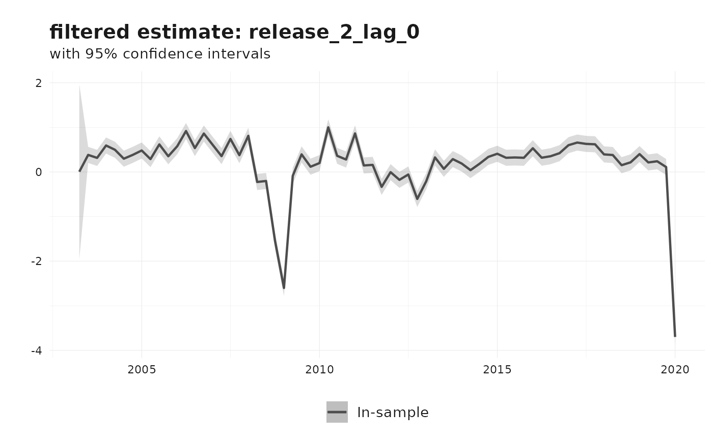

# Nowcasting revisions using the generalized Kishor-Koenig family

This vignette describes the generalized Kishor-Koenig (KK) revision
model and its nested variants as implemented in
[`reviser::kk_nowcast()`](https://p-wegmueller.github.io/reviser/reference/kk_nowcast.md).
The exposition uses the same Durbin-Koopman state-space notation that
appears throughout the package documentation: observation matrices are
denoted by $Z$, transition matrices by $T$, shock-loading matrices by
$R$, and disturbance covariance matrices by $H$ and $Q$([Durbin and
Koopman 2012](#ref-durbinTimeSeriesAnalysis2012)).

The motivation is straightforward. Early releases of macroeconomic
series are often revised several times before they settle near a stable
value. Rather than ignoring that revision process, the KK family models
the vector of releases directly and uses the Kalman filter to infer the
latent efficient estimate.

## Revision system

Suppose that an efficient estimate becomes available after $e$
revisions. Let $y_{t}^{j}$ denote the $j$-th release for reference
period $t$, where $j = 0,\ldots,e$. Following Strohsal and Wolf
([2020](#ref-strohsalDataRevisionsGerman2020)), stack the efficient
estimates and the observed real-time releases as

$$z_{t} = \begin{bmatrix}
y_{t - e}^{e} \\
y_{t - e + 1}^{e} \\
\vdots \\
y_{t}^{e}
\end{bmatrix},\qquad y_{t} = \begin{bmatrix}
y_{t - e}^{e} \\
y_{t - e + 1}^{e - 1} \\
\vdots \\
y_{t}^{0}
\end{bmatrix}.$$

The generalized KK model is

$$z_{t} = Fz_{t - 1} + \nu_{t},\qquad\nu_{t} \sim N(0,V),$$

$$y_{t} = (I - G)Fy_{t - 1} + Gz_{t} + \epsilon_{t},\qquad\epsilon_{t} \sim N(0,W).$$

The companion-form transition matrix is

$$F = \begin{bmatrix}
0 & 1 & 0 & \cdots & 0 \\
0 & 0 & 1 & \cdots & 0 \\
\vdots & \vdots & \vdots & \ddots & \vdots \\
0 & 0 & 0 & \cdots & 1 \\
0 & 0 & 0 & \cdots & F_{0}
\end{bmatrix},$$

and the gain matrix is

$$G = \begin{bmatrix}
1 & 0 & \cdots & 0 \\
G_{e - 1,e} & G_{e - 1,e - 1} & \cdots & G_{e - 1,0} \\
G_{e - 2,e} & G_{e - 2,e - 1} & \cdots & G_{e - 2,0} \\
\vdots & \vdots & \ddots & \vdots \\
G_{0,e} & G_{0,e - 1} & \cdots & G_{0,0}
\end{bmatrix}.$$

Intuitively, $F$ governs the dynamics of the efficient estimate, while
$G$ controls how quickly incoming releases absorb new information. The
covariance matrices $V$ and $W$ describe uncertainty in the latent
efficient estimate and the published releases, respectively.

## Nested models

The generalized KK setup nests two useful special cases.

- The **Classical measurement-error model** is obtained by setting
  $G = I$. In that case, published data are noisy measurements of the
  latent efficient estimate, with no revision persistence beyond the
  state dynamics.
- The **Howrey model** ([Howrey
  1978](#ref-howreyUsePreliminaryData1978)) allows revision persistence
  but restricts the gain matrix by imposing $G_{e - i,0} = 0$ for
  $i = 1,\ldots,e - 1$ and $G_{0,0} = 1$.

The `model` argument in
[`kk_nowcast()`](https://p-wegmueller.github.io/reviser/reference/kk_nowcast.md)
selects among these specifications: `"KK"`, `"Howrey"`, and
`"Classical"`.

## Durbin-Koopman state-space form

To run filtering and smoothing, `reviser` casts the KK system into the
standard time-invariant state-space form

$$y_{t} = Z\alpha_{t} + \varepsilon_{t},\qquad\varepsilon_{t} \sim N(0,H),$$

$$\alpha_{t + 1} = T\alpha_{t} + R\eta_{t},\qquad\eta_{t} \sim N(0,Q).$$

Define the augmented state as

$$\alpha_{t} = \begin{bmatrix}
z_{t} \\
r_{t}
\end{bmatrix},\qquad r_{t} = y_{t} - z_{t}.$$

With this choice of state vector, the implementation in `kk_to_ss()`
uses

$$Z = \begin{bmatrix}
I & I
\end{bmatrix},\qquad T = \begin{bmatrix}
F & 0 \\
0 & {(I - G)F}
\end{bmatrix},\qquad R = I.$$

The observation disturbance is set to zero, so $H = 0$. All uncertainty
is collected in the state disturbance covariance matrix

$$Q = \begin{bmatrix}
V & {- V(I - G)\prime} \\
{- (I - G)V} & {W + (I - G)V(I - G)\prime}
\end{bmatrix}.$$

This is exactly the Durbin-Koopman representation used internally by
`reviser`: the Kalman filter and smoother operate on $(Z,T,R,H,Q)$,
while the KK-specific parameters $(F,G,V,W)$ remain the economically
interpretable layer.

## Estimation in `reviser`

[`kk_nowcast()`](https://p-wegmueller.github.io/reviser/reference/kk_nowcast.md)
supports three estimators.

- `method = "SUR"` estimates the original revision equations jointly by
  seemingly unrelated regression using
  [`systemfit::nlsystemfit()`](https://rdrr.io/pkg/systemfit/man/nlsystemfit.html).
- `method = "OLS"` estimates the equations one by one. This is fast, but
  the cross-equation restrictions are not fully efficient.
- `method = "MLE"` estimates the state-space model by maximum likelihood
  using the Kalman filter.

For applied work, the MLE route is usually the most flexible because it
supports information criteria, Hessian- or QML-based standard errors,
and filtered or smoothed states directly from the state-space model.

## Example: Euro Area GDP revisions

We illustrate the workflow with Euro Area GDP growth from
[`reviser::gdp`](https://p-wegmueller.github.io/reviser/reference/gdp.md).
We first identify an efficient release among the first 15 vintages, then
estimate the full KK model.

``` r
library(reviser)
library(dplyr)
library(tidyr)
library(tsbox)

gdp <- reviser::gdp |>
  tsbox::ts_pc() |>
  dplyr::filter(
    id == "EA",
    time >= min(pub_date),
    time <= as.Date("2020-01-01")
  ) |>
  tidyr::drop_na()

df <- get_nth_release(gdp, n = 0:14)
final_release <- get_nth_release(gdp, n = 15)

efficient_release <- load_or_build_vignette_result(
  "nowcasting-revisions-kk-efficient-release.rds",
  function() get_first_efficient_release(df, final_release)
)
summary(efficient_release)
#> Efficient release:  2 
#> 
#> Model summary: 
#> 
#> Call:
#> stats::lm(formula = formula, data = df_wide)
#> 
#> Residuals:
#>      Min       1Q   Median       3Q      Max 
#> -0.34873 -0.08185 -0.00706  0.10475  0.31533 
#> 
#> Coefficients:
#>             Estimate Std. Error t value Pr(>|t|)    
#> (Intercept)  0.03276    0.01775   1.846   0.0692 .  
#> release_2    1.01446    0.02440  41.577   <2e-16 ***
#> ---
#> Signif. codes:  0 '***' 0.001 '**' 0.01 '*' 0.05 '.' 0.1 ' ' 1
#> 
#> Residual standard error: 0.1428 on 68 degrees of freedom
#> Multiple R-squared:  0.9622, Adjusted R-squared:  0.9616 
#> F-statistic:  1729 on 1 and 68 DF,  p-value: < 2.2e-16
#> 
#> 
#> Test summary: 
#> 
#> Linear hypothesis test:
#> (Intercept) = 0
#> release_2 = 1
#> 
#> Model 1: restricted model
#> Model 2: final ~ release_2
#> 
#> Note: Coefficient covariance matrix supplied.
#> 
#>   Res.Df Df     F  Pr(>F)  
#> 1     70                   
#> 2     68  2 2.743 0.07151 .
#> ---
#> Signif. codes:  0 '***' 0.001 '**' 0.01 '*' 0.05 '.' 0.1 ' ' 1

data_kk <- efficient_release$data
e <- efficient_release$e
```

The selected value of `e` tells us how many revision rounds are needed
before a release is statistically close to the final benchmark.

``` r
fit_kk <- load_or_build_vignette_result(
  "nowcasting-revisions-kk-fit.rds",
  function() kk_nowcast(
    df = data_kk,
    e = e,
    model = "KK",
    method = "MLE",
    solver_options = list(
      method = "L-BFGS-B",
      maxiter = 100,
      se_method = "hessian"
    )
  )
)

summary(fit_kk)
#> 
#> === Kishor-Koenig Model ===
#> 
#> Convergence: Success 
#> Log-likelihood: 125.7 
#> AIC: -231.41 
#> BIC: -198.23 
#> 
#> Parameter Estimates:
#>  Parameter Estimate Std.Error
#>         F0    0.633     0.131
#>       G0_0    0.950     0.031
#>       G0_1   -0.037     0.152
#>       G0_2   -0.181     0.220
#>       G1_0   -0.009     0.011
#>       G1_1    0.594     0.061
#>       G1_2    0.194     0.092
#>         v0    0.380     0.068
#>       eps0    0.008     0.001
#>       eps1    0.001     0.000
```

The parameter table reports the estimated transition coefficient
$F_{0}$, the gain-matrix elements $G_{i,j}$, and the state and
observation variances.

``` r
fit_kk$params
#>    Parameter     Estimate    Std.Error
#> 1         F0  0.632965335 0.1313813639
#> 2       G0_0  0.950076539 0.0308315303
#> 3       G0_1 -0.036660310 0.1517629398
#> 4       G0_2 -0.180790257 0.2201177887
#> 5       G1_0 -0.008913846 0.0109883743
#> 6       G1_1  0.594486360 0.0612313441
#> 7       G1_2  0.194005812 0.0915497686
#> 8         v0  0.379874788 0.0683792923
#> 9       eps0  0.007785910 0.0014196296
#> 10      eps1  0.001397112 0.0002435075
```

The `states` element contains filtered and smoothed estimates of the
latent state vector in tidy format.

``` r
fit_kk$states |>
  dplyr::filter(filter == "smoothed") |>
  dplyr::slice_tail(n = 8)
#> # A tibble: 8 × 7
#>   time       state           estimate lower upper filter   sample   
#>   <date>     <chr>              <dbl> <dbl> <dbl> <chr>    <chr>    
#> 1 2018-04-01 release_2_lag_2    0.654 0.652 0.656 smoothed in_sample
#> 2 2018-07-01 release_2_lag_2    0.370 0.368 0.372 smoothed in_sample
#> 3 2018-10-01 release_2_lag_2    0.414 0.412 0.416 smoothed in_sample
#> 4 2019-01-01 release_2_lag_2    0.136 0.134 0.138 smoothed in_sample
#> 5 2019-04-01 release_2_lag_2    0.307 0.305 0.309 smoothed in_sample
#> 6 2019-07-01 release_2_lag_2    0.441 0.439 0.443 smoothed in_sample
#> 7 2019-10-01 release_2_lag_2    0.147 0.146 0.149 smoothed in_sample
#> 8 2020-01-01 release_2_lag_2    0.299 0.297 0.301 smoothed in_sample
```

The default plot method shows the filtered estimate of the efficient
release and its confidence interval.

``` r
plot(fit_kk)
```



## Other KK-family specifications

The same data can be estimated under the nested Howrey and Classical
restrictions.

``` r
fit_howrey <- kk_nowcast(
  df = data_kk,
  e = e,
  model = "Howrey",
  method = "MLE"
)

fit_classical <- kk_nowcast(
  df = data_kk,
  e = e,
  model = "Classical",
  method = "MLE"
)
```

Those alternatives are useful when the unrestricted gain matrix of the
full KK model is too parameter rich for the available sample.

Durbin, James, and Siem Jan Koopman. 2012. *Time Series Analysis by
State Space Methods: Second Edition*. Oxford University Press.
<https://doi.org/10.1093/acprof:oso/9780199641178.001.0001>.

Howrey, E. Philip. 1978. “The Use of Preliminary Data in Econometric
Forecasting.” *The Review of Economics and Statistics* 60 (2): 193.
<https://doi.org/10.2307/1924972>.

Strohsal, Till, and Elias Wolf. 2020. “Data Revisions to German National
Accounts: Are Initial Releases Good Nowcasts?” *International Journal of
Forecasting* 36 (4): 1252–59.
<https://doi.org/10.1016/j.ijforecast.2019.12.006>.
